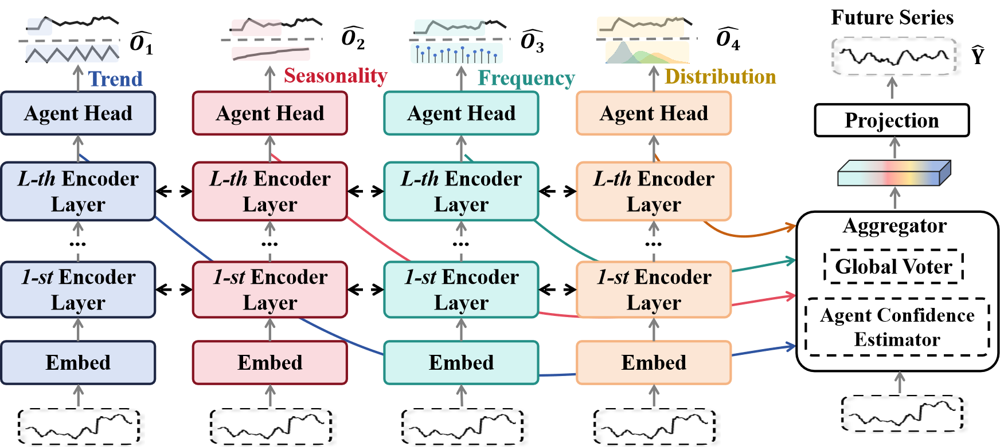
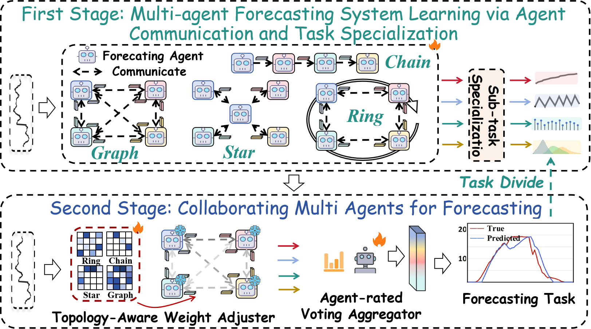
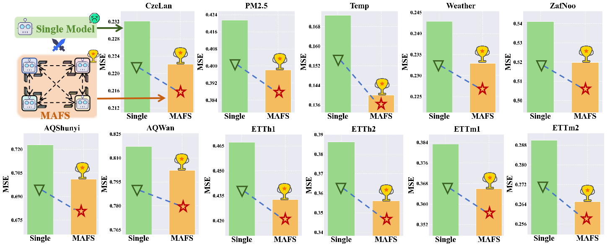
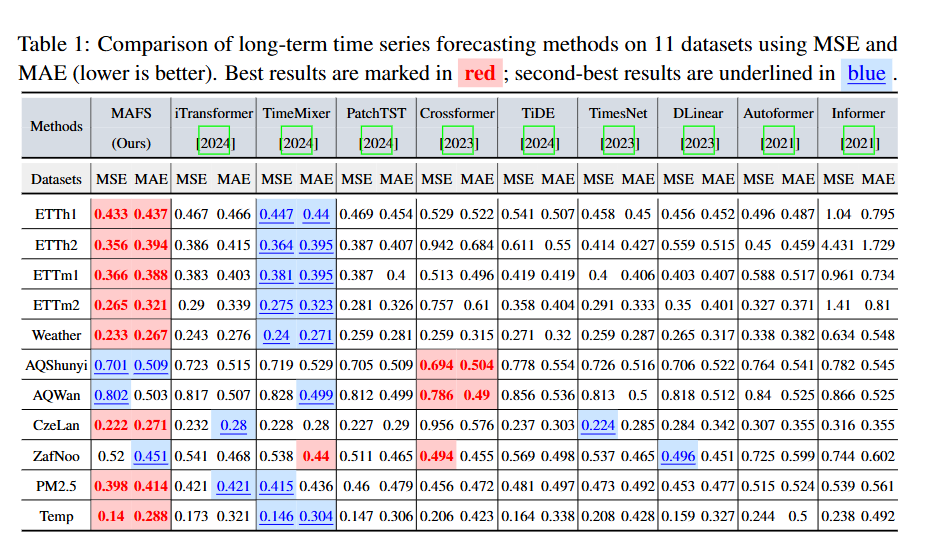
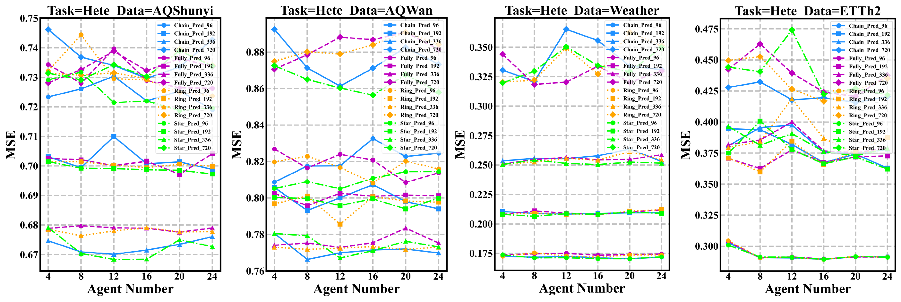
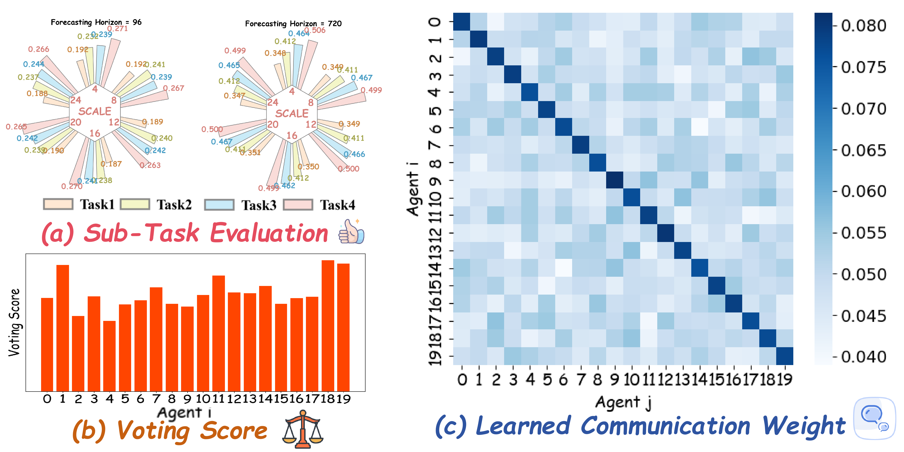

## Many Minds, One Goal: Time Series Forecasting via Sub-task Specialization and Inter-agent Cooperation

This repository contains the official implementation of our paper **"Many Minds, One Goal: Time Series Forecasting via Sub-task Specialization and Inter-agent Cooperation."**



---

### Project Structure

The project is divided into two subfolders according to the **sub-task division strategies for agent specialization**:

* `heterogeneous_sub_task`: Agents are assigned *heterogeneous forecasting tasks*, each focusing on different aspects of the time series, including:
* Statistical characteristics
  * Spectral energy distribution
  * Future seasonality
  * Future trend
  
* `homogeneous_sub_task`: Agents are assigned *homogeneous forecasting tasks*, all predicting the same variable but at different temporal resolutions (i.e., multi-scale future forecasting).

---

### Model Architecture





Each agent is implemented by iTransformer Architecture. The overall framework follows a **pre-training → fine-tuning** paradigm:

* During **pre-training**, each agent is trained to specialize in its assigned forecasting sub-task. Agents communicate via the `communication` module using one of four predefined **fixed-topology graphs**:

  * **Ring**, **Star**, **Chain**, or **Fully-connected**
    These structures facilitate inter-agent information exchange—balancing specialization with global awareness.

* In the **fine-tuning phase**, all agents are **frozen**, and the fixed communication edges are replaced with **learnable weights**, enabling the system to learn optimal communication flows specific to the forecasting objective.

* A final **Agent-Rated Voting Aggregator** integrates the predictions from all agents to produce the final output, leveraging collective intelligence.

---

### Datasets

We evaluate our method on **11 public benchmark datasets**:

* From [Autoformer](https://github.com/thuml/Autoformer):
  `ETTh1`, `ETTh2`, `ETTm1`, `ETTm2`, `Weather`

* From [TFB](https://github.com/decisionintelligence/TFB):
  `AQShunyi`, `AQWan`, `CzeLan`, `ZafNoo`

* From [PM2.5 Benchmark](https://github.com/shuowang-ai/PM2.5-GNNr):
  `PM2.5`, `Temp`

Place all datasets under the `./dataset` directory.

---

### Running the Code

We provide all training scripts under `./scripts/{dataset_name}.sh`.
Common settings include:

```bash
--learning_rate 1e-3
--e_layers 2
--d_model 128
--d_ff 128
```

For single-agent comparisons, you may run experiments in the `./single_agent_forecasting` folder under a fair setting using the same configuration.

---

### Results

Our multi-agent forecasting system (MAFS) achieves a **6.35% improvement** in forecasting performance compared to single-model baselines.

Despite using **iTransformer** (not the current SOTA) as the agent backbone, MAFS achieves:

* **16× Top-1** performance
* **4× Top-2** performance
  across **22 metrics on 11 datasets**.

<div align="center">
  
</div>

<div align="center">
  
</div>

---

### Ablation Studies

We further analyze the effect of the **number of agents** and the **communication topology** on performance:

<div align="center">
  
</div>

---

### Case Study

<div align="center">
  
</div>